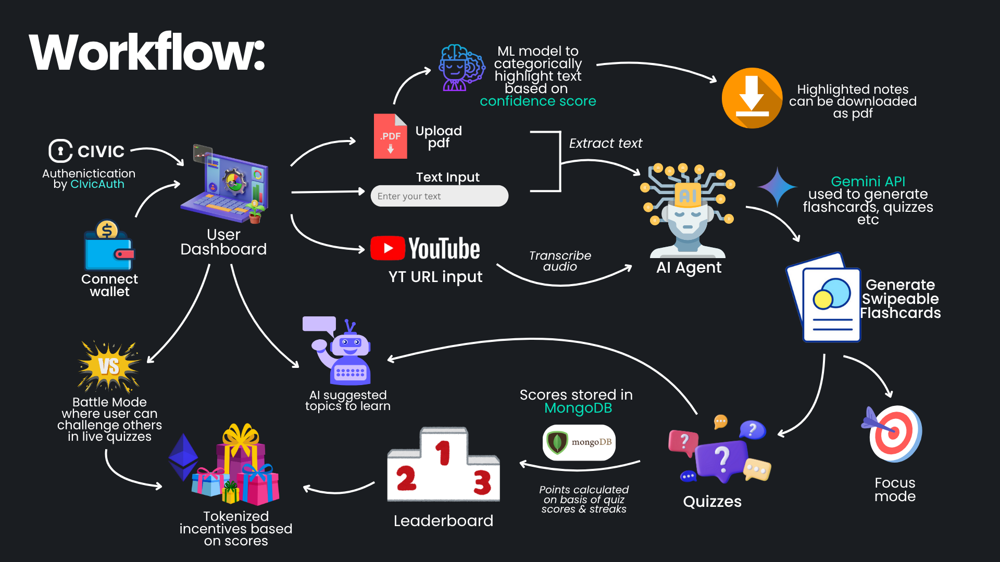

# ⚡MindSnap — Short attention? Meet smart learning.

**MindSnap** is a community-powered **microlearning platform** built for the next generation of learners — fast-paced, short-attention, always-on.  

We bridge the widening gap between **quality educational content** and the modern-day consumption habit formed by short-form content like Reels, Shorts, and TikToks. 

Using **AI**, **gamification**, and **Web3 rewards**, MindSnap makes learning addictive, engaging, and rewarding.
<br><br>


<br><br>

## 🚀 Features

### 📥 Upload Anything  
Feed in **YouTube links, PDFs, images, audio**, or **plain text** — MindSnap transforms any format into concise, swipeable flashcards in seconds.

### 🎭 Choose Your Vibe  
Make learning match your mood. Select your preferred style:  
- **Factual** – Crisp and to-the-point  
- **Conceptual** – Logical and in-depth  
- **Story Mode** – Narrative-driven learning  
- **Gen Z** – Casual, quirky, and relatable

### 📄 Intelligent PDF Highlighting  
Upload a PDF and receive a **cleanly highlighted version**, with key content auto-selected by our ML model using **confidence-based ranking** — ideal for revision and focus.

### 🔍 Flashcard Focus Mode  
Each card unlocks a mini AI assistant. Ask it to:  
- **Explain** difficult concepts  
- **Summarize** dense info  
- **Expand** on short answers  
- **Translate** content into Hindi, Bengali, or any major language

### 🧪 Auto-Generated Quizzes  
After every flashcard set, MindSnap builds a tailored quiz. Your score is:  
- **Stored automatically**  
- **Synced live** to your leaderboard rank

### ⚔️ 1v1 Real-Time Quiz Battles  
Challenge your friends in **private quiz arenas**:  
- Share a unique room code  
- Face off in **fast-paced, real-time duels**  
- Earn **XP, ranks, and token rewards** — bragging rights included

### 🏆 Leaderboards & Token Rewards  
- 📈 **Live leaderboards** (weekly & monthly)  
- 🏅 **Hall of Fame** with top performers spotlighted  
- 🎉 **Token rewards** sent directly to your wallet

> 💡 **Smart Contract deployed on Base Sepolia**  
> [`0x0275e553e47c4f11074bdFe4651164b98906c0F4`](https://sepolia.basescan.org/address/0x0275e553e47c4f11074bdFe4651164b98906c0F4)

### 👤 User Profiles  
Stay on top of your learning journey with real-time **stats, rank, quiz history**, and **wallet activity** — all in one place.

### 🔐 Secure Authentication  
Seamless login with **Civic Auth**, ensuring your sessions are **safe**, **private**, and **Web3-compatible**.

 ---
## 🧭 How It All Works

A snapshot of the entire workflow, from upload to leaderboard:



## ⚙️ Installation & Running Guide

### 🔧 Prerequisites
- Node.js (v18+)
- Python (v3.10+)
- Git
- npm or yarn

---

### 1. Clone the Repo
```bash
git clone <your-repo-url>
cd MindSnap
```
### 2. Set Up Python Backend
```bash
cd agent
python -m venv venv
# Windows:
venv\Scripts\activate
# macOS/Linux:
source venv/bin/activate
pip install -r requirements.txt
```
### 3. Set Up Frontend
```bash
cd frontend
npm install
cp .env.example .env.local
```
### 4. Running the App
```bash
# Start Backend
cd agent
python app.py

# Start Frontend
cd ../frontend
npm run dev
```
